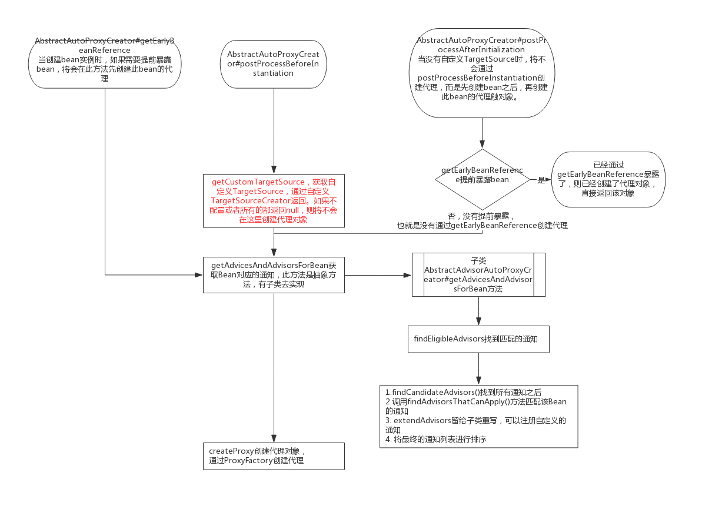

前面讲到了使用XML 配置`ProxyFactoryBean`，结合注解配置`@Bean`也可以实现代码配置。还讲到了代码配置`ProxyFactory`。前者与Spring IOC 容器结合的更紧密，不需要自己调用`getProxy()`方法，从IOC 容器中获取的Bean 已经是最终的代理对象。

这两种方式需要我们自己设置目标对象，通知以及代理接口，使用起来还是比较繁琐的。每当我们需要一个代理对象时，就需要配置`ProxyFactoryBean`或`ProxyFactory`。

有没有更好的方式，只需要做简单的配置就可以为多个对象生成代理对象呢？

我们已经有了创建代理的方式，就是前面介绍的工厂类，剩下的工作只需要解决如何配置和如何解析配置的问题就可以了。

下面介绍最核心的类。

## AbstractAutoProxyCreator

看看Spring 官方介绍：

> 该抽象类实现了BeanPostProcessor接口，用AOP代理来包装每个合适的bean，并在调用bean本身之前委托给指定的拦截器。这个类区分了“公共”拦截器和“特定”拦截器，前者用于它创建的所有代理，后者用于每个bean实例。可以不需要任何通用的拦截器。如果有，则可以使用`interceptorNames`属性设置它们。与org.springframework.aop.framework.ProxyFactoryBean 一样，使用拦截器名称而不是bean引用来正确处理原型顾问和拦截器：例如，支持有状态的混合。`interceptorNames`属性支持任何通知类型。
>
> 如果有大量的bean需要用类似的代理(即委托给相同的拦截器)来包装，那么这种自动代理特别有用。可以在bean工厂中注册一个这样的后处理程序，而不是为x个目标bean进行x个重复的代理定义，来达到相同的效果。
>
> 子类可以应用任何策略来决定一个bean是否被代理，例如通过类型、名称、bean定义细节等。它们还可以返回额外的拦截器，这些拦截器应该只应用于特定的bean实例。`BeanNameAutoProxyCreator`是一个简单的实现类，它通过指定名称识别要代理的bean。
>
> 可以使用任意数量的`TargetSourceCreator`实现来创建自定义目标源:例如，来共享原型对象。只要`TargetSourceCreator`指定了自定义`TargetSource`，即使没有通知，也会发生自动代理。如果没有设置TargetSourceCreator，或者没有匹配上，那么默认情况下将使用 `SingletonTargetSource`来包装目标bean实例.

从上面的描述中，可以看出此类实现了`BeanPostProcessor`接口，拦截bean的创建过程。并提供了自定义获取目标对象的方式，以及识别通知，创建代理对象的核心逻辑。子类提供了多种更具体的创建代理的策略。

### 类图


从上图中可以看到此类实现了`SmartInstantiationAwareBeanPostProcessor`接口，该接口在前面*Bean的初始化中*讲到过，如果`postProcessBeforeInstantiation`方法返回了非`null`对象，则将会打断原bean的初始化过程，从而使用该方法返回的对象。如果上面的方法返回`null`，那么将走常规初始化对象方式，初始化对象之后将调用`postProcessAfterInitialization`方法，在此方法中可以根据需要返回代理对象。

我们猜想一下如何创建？

1. 判断是否需要创建
2. 判断之前是否创建过
3. 找到目标对象所有匹配的通知
4.  有了通知，剩下的就是通过之前的创建代理的方式来创建。

###  postProcessBeforeInstantiation 方法

此方法将会在进行常规化实例bean时执行，如果不需要阻断初始化流程，则需要返回`null`。在这个方法实现中提供了一个自定义目标对象获取方式的机会，即`TargetSourceCreator`，如果注册了该接口的实现类并且返回非`null`目标对象，那么将在`postProcessBeforeInstantiation`方法中创建代理对象。如果没有注册或者注册的`TargetSourceCreator`实现都返回`null`，那么不会在`postProcessBeforeInstantiation`方法中创建代理对象，走常规初始化流程。初始化bean之后还有机会再次修改bean实例。

默认直接从Spring 工厂中拿对应的bean实例，并不会在此处实现自定义`TargetSourceCreator`接口。

```java
Object cacheKey = getCacheKey(beanClass, beanName);
if (!StringUtils.hasLength(beanName) || !this.targetSourcedBeans.contains(beanName)) {
    if (this.advisedBeans.containsKey(cacheKey)) {
        return null;
    }
    if (isInfrastructureClass(beanClass) || shouldSkip(beanClass, beanName)) {
        this.advisedBeans.put(cacheKey, Boolean.FALSE);
        return null;
    }
}
TargetSource targetSource = getCustomTargetSource(beanClass, beanName);
if (targetSource != null) {
    if (StringUtils.hasLength(beanName)) {
        this.targetSourcedBeans.add(beanName);
    }
    Object[] specificInterceptors = getAdvicesAndAdvisorsForBean(beanClass, beanName, targetSource);
    Object proxy = createProxy(beanClass, beanName, specificInterceptors, targetSource);
    this.proxyTypes.put(cacheKey, proxy.getClass());
    return proxy;
}
```

### postProcessAfterInitialization 方法

在前面的方法中如果返回了`null`，那么将会继续初始化bean。初始化之后将调用`BeanPostProcessor.postProcessAfterInitialization`方法。`AbstractAutoProxyCreator`将在此方法中创建代理对象。这里有个小地方要注意，因为在实例化的过程中，如果是要提前暴露出来的bean，将会提前加入到`singletonFactories` map中，在获取这个bean的时候将会调用`getEarlyBeanReference`方法，也就是说可能需要在这个方法中创建代理对象，所以如果已经在`getEarlyBeanReference`方法中创建了，那么在`postProcessAfterInitialization`方法中就不需要再创建一次了。

```java
if (bean != null) {
    Object cacheKey = getCacheKey(bean.getClass(), beanName);
    if (!this.earlyProxyReferences.contains(cacheKey)) {
        return wrapIfNecessary(bean, beanName, cacheKey);
    }
}
return bean;
```

### getEarlyBeanReference 方法

在提前暴露bean时会调用此方法。

```java
@Override
public Object getEarlyBeanReference(Object bean, String beanName) {
    Object cacheKey = getCacheKey(bean.getClass(), beanName);
    if (!this.earlyProxyReferences.contains(cacheKey)) {
        this.earlyProxyReferences.add(cacheKey);
    }
    return wrapIfNecessary(bean, beanName, cacheKey);
}
```

### 判断是否需要创建

看过了上面3个入口的代码，主要用`isInfrastructureClass(beanClass) `和 `shouldSkip(beanClass, beanName)`两个方法来判断。

`isInfrastructureClass`用来判断该类是不是基础类，包括`Advice`、`Pointcut`、`Advisor`和`AopInfrastructureBean` 这些aop基础接口实现类，这些类的对象不应该被代理。

`shouldSkip(beanClass, beanName)` 用来实现自定义的跳过逻辑，子类可以重写该方法。默认判断实例类是不是以`.ORIGINAL`结尾，是则跳过，反之则不跳过。

### 判断之前是否创建过

通过`earlyProxyReferences` Set 将 提前暴露出来的bean缓存起来，`advisedBeans` Map用来存放经过历增强过程的Bean，已经增强过的对应的`value`为`True`，不需要增强的则为`False`。`targetSourcedBeans` Set用来将自定义`TargetSource`的bean缓存起来。

1. 在调用`postProcessBeforeInstantiation`方法时，如果没有传bean name，或者`targetSourcedBeans`不包含bean name，那么如果`advisedBeans`包含此缓存key(缓存key是以bean的Class和name来组成的，如果没有name则只使用class)，则代表之前已经处理过这种class或者bean name，直接返回`null`。

   如果在此方法中创建了代理，则会将bean name 加入到`targetSourcedBeans`。

2. 在调用`getEarlyBeanReference`方法时，如果`earlyProxyReferences` Set中没有包含此缓存key，则将此缓存key加入到`earlyProxyReferences`。如果bean name不为空并且`targetSourcedBeans`包含bean name，则意味着在第一中情况中已经创建了代理，直接返回该bean。

   如果`advisedBeans`中缓存key对应的值为`False`，则意味着这个bean不需要创建代理，直接返回此bean。

3. 在调用`postProcessAfterInitialization`方法时，如果`earlyProxyReferences` Set中包含此缓存key，则意味着在第二种情况中已经创建了代理，直接返回此bean即可。

   如果bean name不为空并且`targetSourcedBeans`包含bean name，则意味着在第一种情况中已经创建了代理，直接返回该bean。

   如果`advisedBeans`中缓存key对应的值为`False`，则意味着这个bean不需要创建代理，直接返回此bean。

   

由于有三个入口可以用来创建代理对象，因此要保证只创建一次，所以用了上面的方式。

下面看一下完整的流程图：



###  getAdvicesAndAdvisorsForBean 方法

此方法用来查找当前bean匹配的通知，是一个抽象方法，需要子类去实现具体的查找逻辑。

查到到之后将通知的拦截器转换为Spring 的`Advisor`，这个转换过程中，可以预先配置通用的拦截器，可以在每个bean中生效，

具体的转换方法是org.springframework.aop.framework.adapter.AdvisorAdapterRegistry#wrap()。